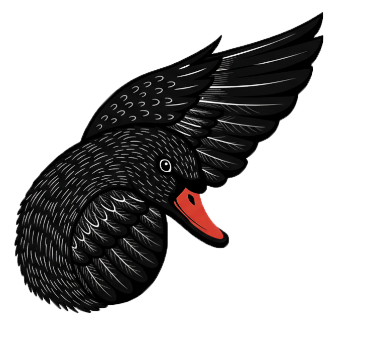

<h1 align="center">
  
  &nbsp;ODILE
</h1>

<p align="center"><b>Weight-Level Defenses Improve LLM Prompt Injection Robustness</b></p>

<p align="center">
  <a href="https://github.com/memo-ozdincer/odile-paper-package"></a>
  <a href="https://huggingface.co/memo-ozdincer/ODILE"></a>
  <a href="LICENSE"></a>
  
</p>

ODILE is a **representation-level LoRA defense** against indirect prompt injection (IPI)
in tool-using LLM agents. It is a single LoRA adapter at a mid-to-late transformer layer
band, trained on **paired (benign, attacked) trace twins** with the **ODILE loss** — a
paired-trace contrast on the model's *own* harmful direction, applied only on the early
completion tokens where the agent commits to following or ignoring an injection.

Under attack, the adapter produces **jam**: degenerate token sequences with no parseable
tool call, so the attacker-specified action is never emitted. ODILE keys on the
trajectory's intent rather than the injection's surface form, so it is format-portable and
holds under gradient-based and semantic (PAIR/TAP) adaptive attacks — all at **1× inference
cost with no external dependencies** (no detector, no second pass).

On AgentDojo with Llama-3.3-70B, ODILE reduces attack-success rate (ASR) from **14.04% to
0.01%** while retaining benign utility (**59.8%** vs. 59.9% base). The same recipe transfers
across six Llama and Qwen backbones and to the out-of-distribution AgentDyn suites; it drives
InjecAgent ASR to near-zero and TensorTrust extract-leak rates from 78–92% down to 1–44%.
Meta-SecAlign-70B holds the high-utility, higher-ASR corner of the same Pareto frontier;
ODILE holds the low-ASR corner while retaining benign utility.

> 📄 **Paper:** *Weight-Level Defenses Improve LLM Prompt Injection Robustness.*
> Mehmet Ozdincer, Samuel Simko, Bernhard Schölkopf, Zhijing Jin. **Preprint, 2026 (under review).**
> Source at [memo-ozdincer/odile-paper-package](https://github.com/memo-ozdincer/odile-paper-package).
>
> 🤗 **Adapters:** [memo-ozdincer/ODILE](https://huggingface.co/memo-ozdincer/ODILE) —
> one LoRA per backbone (Llama-3.1-8B, Llama-3.3-70B, Qwen2.5-7B/14B, Qwen3-8B/32B, Qwen3-Next-80B).

## What's in this repo

This is the training + evaluation code released with the paper. It lets you:

- **Train** an ODILE adapter for any supported backbone from the bundled paired traces.
- **Serve** a backbone + ODILE adapter on vLLM.
- **Evaluate** on AgentDojo (the four task suites × the five standard attacks) and read off
  ASR and benign utility.

```
odile/
├── src/odile/          # package: trainer, evaluator, recipes, CLI (+ vendored AgentDojo core)
├── data/traces/        # bundled paired training traces (Odette/Odile twins), per backbone
├── scripts/            # download_adapters.py
├── examples/           # minimal load-an-adapter + run-one-attack demo
├── REPRODUCE.md        # end-to-end runbook
└── pyproject.toml
```

## Install

Uses [uv](https://docs.astral.sh/uv/) (any PEP 517 installer works).

```bash
uv venv --python 3.11
uv pip install -e ".[serve]"      # CLI + AgentDojo evaluation + vLLM serving
uv pip install -e ".[training]"   # add this to train adapters / load them with PeftModel
```

The core install (CLI + evaluation client) is light; `torch`/`transformers`/`peft` come in
with `[training]`, and `vllm` with `[serve]`.

## Quickstart (evaluate the published adapter)

```bash
# 1. fetch the Llama-3.3-70B ODILE adapter from the Hugging Face Hub
python scripts/download_adapters.py llama-70b

# 2. serve base + adapter on vLLM (exposes models "base" and "odile" on one endpoint)
odile serve llama-70b

# 3. in another shell: run the AgentDojo grid (4 suites x 5 standard attacks)
odile eval grid --models base odile --format llama_native --output-dir results/
```

Each cell writes a JSON result to `results/`; ASR is AgentDojo's hand-coded security
predicate (harmful tool execution) and benign utility is task success on the no-attack split.

## Quickstart (train ODILE)

```bash
odile recipes                 # list the per-backbone recipes
odile train llama-70b         # headline; writes to adapters/ODILE_Llama-3.3-70B
odile train qwen3-8b
```

Recipes follow the paper (rank 16, α 32, lr 5e-5, 5 epochs, seed 42; depth-scaled LoRA
layer bands per backbone). The base model defaults to its Hugging Face id; point it at a
local mirror with a trailing override: `odile train llama-70b -- --model /path/to/model`.

See **[REPRODUCE.md](REPRODUCE.md)** for the full end-to-end runbook and per-backbone notes.

## Citation

```bibtex
@misc{ozdincer2026odile,
  title  = {Weight-Level Defenses Improve LLM Prompt Injection Robustness},
  author = {Ozdincer, Mehmet and Simko, Samuel and Sch\"olkopf, Bernhard and Jin, Zhijing},
  year   = {2026},
  note   = {Preprint, under review},
}
```

## License & credits

Code is released under the [Apache-2.0](LICENSE) license. ODILE builds on
[AgentDojo](https://github.com/ethz-spylab/agentdojo) (the evaluation harness and task
suites are vendored under `src/`) and on the circuit-breaker representation-rerouting line
of work. See [NOTICE](NOTICE) for attribution.
