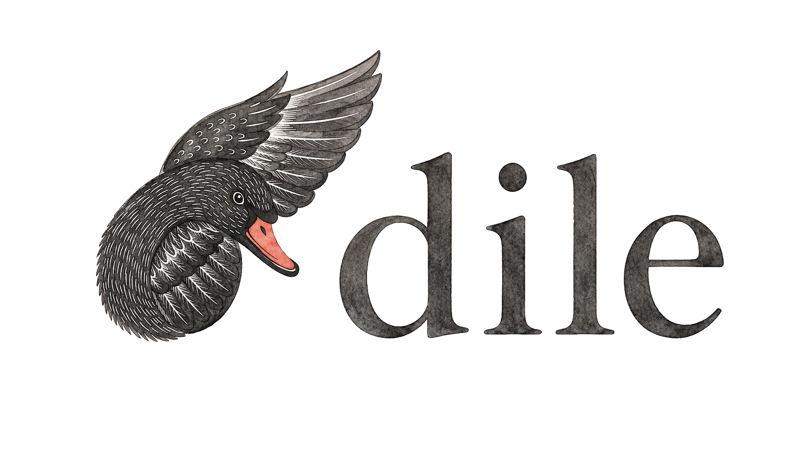

<p align="center">
  
</p>

<p align="center">
  <a href="https://github.com/memo-ozdincer/odile-paper-package"></a>
  <a href="https://huggingface.co/memo-ozdincer/ODILE"></a>
  <a href="LICENSE"></a>
  
</p>

This repository contains the ODILE training, serving, and evaluation code.

## Links

- Paper: https://github.com/memo-ozdincer/odile-paper-package
- Adapters: https://huggingface.co/memo-ozdincer/ODILE

## Repository Layout

```
odile/
|-- src/odile/          # package, CLI, trainer, evaluator, and vendored AgentDojo core
|-- data/traces/        # bundled training traces, grouped by backbone family
|-- scripts/            # adapter download helper
|-- examples/           # minimal adapter-loading demo
|-- REPRODUCE.md        # end-to-end runbook
`-- pyproject.toml
```

## Install

Uses [uv](https://docs.astral.sh/uv/). Any PEP 517-compatible installer should also work.

```bash
uv venv --python 3.11
uv pip install -e ".[serve]"      # CLI, AgentDojo evaluation, and vLLM serving
uv pip install -e ".[training]"   # training and PEFT adapter loading
```

The base install is lightweight. The `[training]` extra installs the model-training stack, and `[serve]` installs the serving/evaluation stack.

## Download Adapters

```bash
python scripts/download_adapters.py llama-70b
python scripts/download_adapters.py qwen3-8b
```

Supported recipe names:

```text
llama-8b
llama-70b
qwen2.5-7b
qwen2.5-14b
qwen3-8b
qwen3-32b
qwen3-next
```

Downloaded adapters are written under `adapters/` using the same subfolder names as the Hugging Face release.

## Serve

```bash
odile serve llama-70b
```

This starts a vLLM server for the configured base model and ODILE adapter. Use `odile recipes` to list the available serving and training recipes.

## Evaluate

```bash
odile eval grid --models base odile --format llama_native --output-dir results/
```

Outputs are written as JSON files under the selected results directory.

## Train

```bash
odile recipes
odile train llama-70b
odile train qwen3-8b
```

Recipe defaults live in `src/odile/recipes.py`. The base model can be overridden with a local path:

```bash
odile train llama-70b -- --model /path/to/model
```

See [REPRODUCE.md](REPRODUCE.md) for the full runbook.

## License

Code is released under the [Apache-2.0](LICENSE) license. See [NOTICE](NOTICE) for third-party attribution.

## Citation

```bibtex
@misc{ozdincer2026odile,
  title  = {Weight-Level Defenses Improve LLM Prompt Injection Robustness},
  author = {Ozdincer, Mehmet and Simko, Samuel and Sch\"olkopf, Bernhard and Jin, Zhijing},
  year   = {2026},
  note   = {Preprint, under review},
}
```
